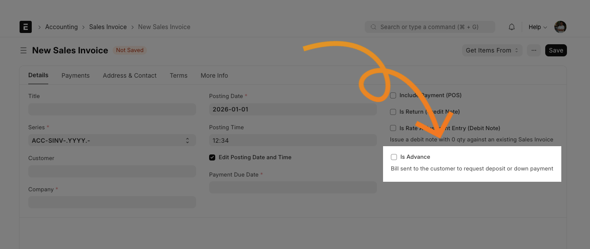

### Advance Invoice

<p align="center">
    
</p>

An ERPNext App for businesses that must issue a VAT invoice when requesting a customer down payment, while recording the down payment as a liability until the final invoice is issued.

This workflow is useful in jurisdictions such as Indonesia where a down payment may require its own VAT document. ERPNext combines the advance settlement and the remaining-balance accounting in one final Sales Invoice.

## What problem does it solve?

Standard ERPNext supports advance payments, but a payment transaction alone may not provide the VAT-invoicing and accounting workflow required for a down payment. This app adds the accounting behavior needed for the following process:

1. Issue a Sales Invoice for the down payment and recognize the applicable VAT.
2. Post the net down payment to the company’s advance-received liability account instead of income.
3. Issue the final Sales Invoice for the completed work.
4. Deduct the previously paid down payment from the final invoice.
5. Leave the customer responsible only for the remaining balance and applicable tax.

## Features

- Reclassifies income credits on an advance Sales Invoice to the Company’s Default Advance Received Account.
- Supports advance settlement through a negative `ADV` item row on the final Sales Invoice.
- Reclassifies the advance settlement to the advance-received liability account.
- Keeps negative settlement rows out of normal discount distribution.
- Rebalances GL differences using the Company’s Round Off Account.

## Requirements

- An ERPNext/Frappe site managed with Bench.
- Python 3.10 or newer.
- A Company configured with a Default Advance Received Account.
- A Company configured with a Round Off Account when GL rounding differences need to be posted.
- The required custom Sales Invoice field described below.
- An item with item code `ADV` for advance settlement rows.
- ERPNext v15. This project is developed, tested, and used on ERPNext v15.

## Installation

From the directory containing your Frappe Bench:

```bash
bench get-app https://github.com/marengga/advance_invoice --branch main
bench --site $SITE_NAME install-app advance_invoice
```

Replace `$SITE_NAME` with your ERPNext site. After installation, run the usual Bench migrations and clear the site cache if your deployment process requires it.

## Configuration

### 1. Add the Sales Invoice custom field

Add a custom field to the **Sales Invoice** DocType with these values:

| Property    | Value                                                        |
| ----------- | ------------------------------------------------------------ |
| Label       | Is Advance                                                   |
| Type        | Check                                                        |
| Field Name  | `custom_is_advance`                                          |
| Mandatory   | No                                                           |
| Description | Bill sent to the customer to request deposit or down payment |

When checked, the Sales Invoice is treated as an advance invoice by this app.

### 2. Prepare the settlement item

Create or configure the settlement item with these values:

| Property       | Value           |
| -------------- | --------------- |
| Item Code      | `ADV`           |
| Item Name      | Advance Payment |
| Default UoM    | Unit            |
| Maintain Stock | No              |

On the item’s **Accounting -> Item Defaults** section, set its **Default Income Account** for the relevant Company. This account is used by the final invoice’s negative settlement row before the app reclassifies the accounting entry to the Company’s Default Advance Received Account.

This item is used on the final Sales Invoice as a negative row to represent the amount already paid as a down payment.

The settlement row must have a negative amount and an income account so the app can identify and reclassify its accounting entry.

### 3. Configure the Company

Make sure the Company’s **Default Advance Received Account** is set. This is the liability account used for the net advance amount.

Also make sure the Company has a **Round Off Account** if the resulting GL entries require rounding adjustments. Assign an appropriate cost center either on the invoice or through the Company defaults where applicable.

## How to use it

### Down-payment invoice

1. Create a Sales Invoice for the down payment.
2. Select the customer, Company, items, and applicable taxes.
3. Check **Is Advance**.
4. Submit the invoice.

The app changes the income-side GL entries for this invoice to the Company’s Default Advance Received Account. The invoice can therefore be used as the ERPNext accounting and VAT-invoicing record for the down payment without recognizing the amount as earned income.

### Final invoice and advance settlement

1. Create the final Sales Invoice for the completed work.
2. Add the actual project or delivered items and applicable taxes.
3. Add an `ADV` item row with a negative amount equal to the down payment already paid.
4. Submit the invoice.

ERPNext uses one final Sales Invoice for both the remaining-balance billing and the advance settlement. The app debits the advance-received liability account for the negative `ADV` amount. The customer then owes the final invoice total after the paid down payment has been deducted.

For the related tax workflow, Tax Staff creates the zero-value VAT document manually in E-Faktur/Coretax and follows the organization’s required references between the down-payment and final documents.

### Example

Assume:

- Down-payment invoice: IDR 200,000,000 plus applicable VAT.
- Final project value: IDR 250,000,000 plus applicable VAT.

The down-payment invoice is marked **Is Advance** and posts its net amount to the advance liability account. The final Sales Invoice contains the IDR 250,000,000 project value and a negative `ADV` row for IDR 200,000,000. The customer pays only the remaining balance shown by the final invoice (IDR 50,000,000), subject to the applicable tax treatment.

## Accounting behavior

The app extends ERPNext’s standard Sales Invoice controller. It:

- redirects positive income credits to the advance account when `custom_is_advance` is checked;
- identifies settlement rows by `item_code == "ADV"` and a negative amount;
- changes the settlement entry into a debit against the advance account; and
- adds or adjusts a round-off entry when the modified GL entries are not balanced.

The app also customizes ERPNext’s tax-and-total calculation so discounts are distributed across positive-value items rather than negative settlement rows.

## Important notes and limitations

- This app changes Sales Invoice accounting; it does not create a separate DocType for VAT documents.
- If needed, the zero-value VAT document in E-Faktur/Coretax is outside the app and must be created manually by Tax Staff.
- The app assumes the custom field, Company account, and `ADV` item are configured correctly.
- The literal item code `ADV` is part of the settlement logic. Changing it requires a code change.
- The app overrides ERPNext’s Sales Invoice class and replaces ERPNext’s tax-calculation class at runtime. ERPNext upgrades should be tested before production deployment.
- Validate VAT document numbering, references, tax timing, returns, cancellations, partial settlements, multi-currency invoices, and credit notes with your accounting and tax teams.
- Always test the resulting GL entries in a non-production ERPNext site before using the workflow for live transactions.

## Contributing

Contributions are welcome. Please open an issue or pull request for bugs, documentation improvements, compatibility updates, tests, or new functionality.

Before submitting a change:

1. Describe the ERPNext/Frappe version and accounting scenario affected.
2. Include reproducible steps and expected versus actual GL entries for accounting changes.
3. Add or update tests when possible.
4. Run the project checks locally.

## License

MIT
